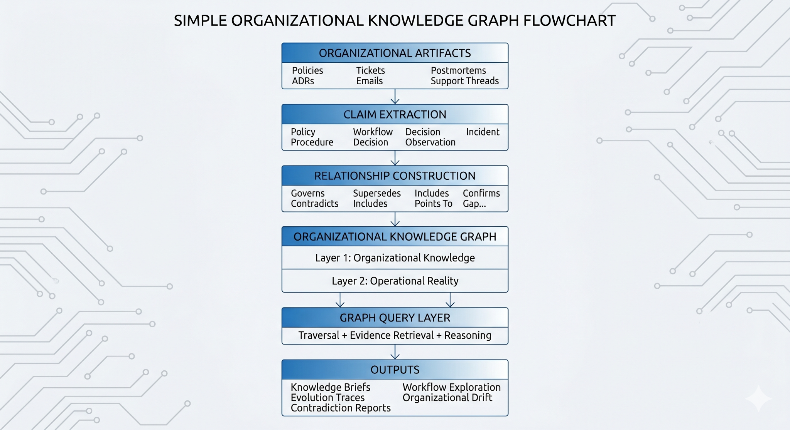
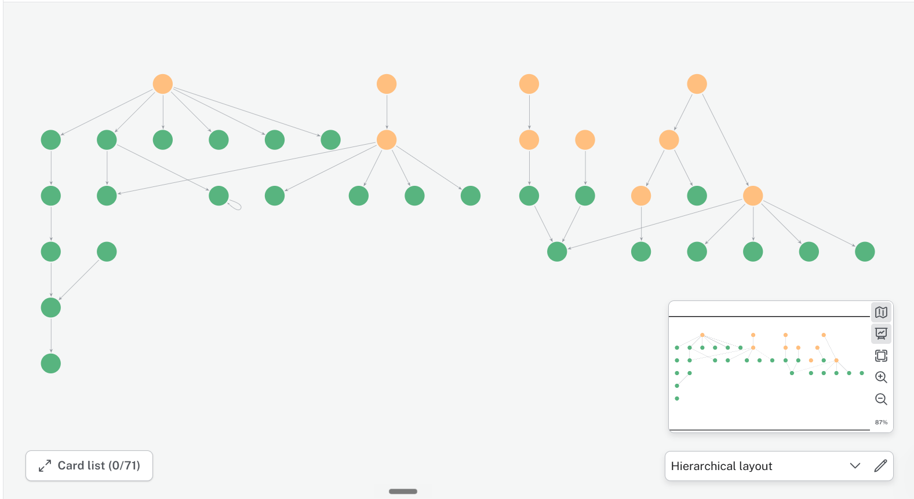
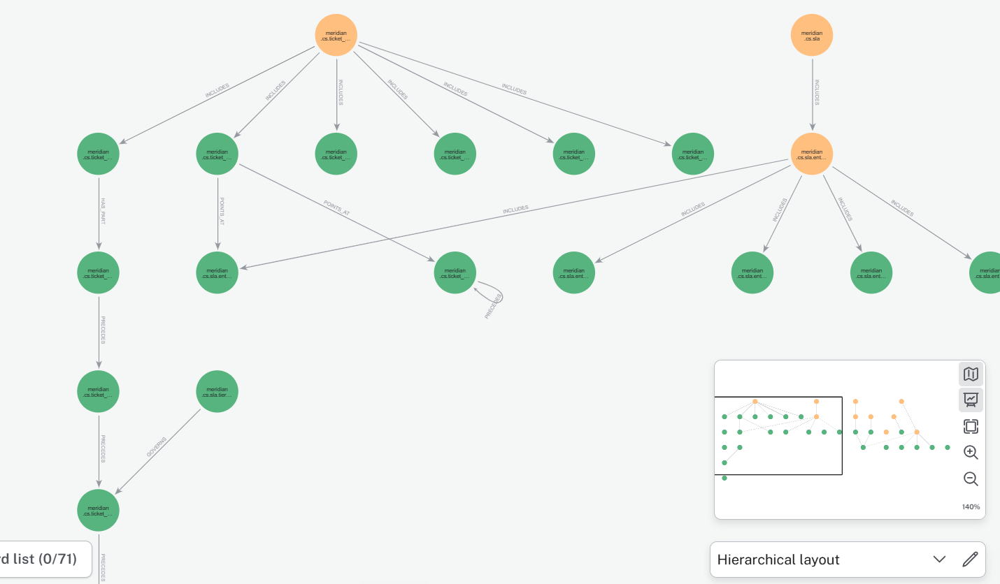

# The Company That Knows Itself

**The system of record for how a company actually operates.**

`Status: End-to-end prototype validated on a realistic synthetic corpus (150+ nodes, 170+ typed relationships)` · `Wedge: B2B software companies` · `Source code: not included — see below`

---

## The problem

Company knowledge isn't missing. It's fragmented, and AI makes that worse.

Every company runs on institutional knowledge — policies, procedures, workflows, decisions — scattered across Confluence, Slack, tickets, ADRs, postmortems. Humans navigate the mess through years of context and asking colleagues. AI agents have no such fallback.

The same failure shows up everywhere, wearing different clothes:

- **Engineering ships a change. CS doesn't know it.** A support agent spends four days troubleshooting something that was intentionally deprecated.
- **Sales commits to a feature on a renewal call.** The RFC governing that feature is still unresolved. Nobody connects the two until the contract is signed.
- **A policy exists. The procedure that implements it was informally replaced six months ago.** Every new hire learns the wrong process, because the outdated document is still the one everyone finds.

RAG retrieves documents but not the relationships between them. LLMs generate answers but collapse away provenance, contradiction, and time. Neither can tell you when two documents conflict, when a policy's been superseded, or when what the company *says* it does has quietly diverged from what it *actually* does.

## The insight

There's a missing structural layer between documents and answers — and it isn't "add a graph." It's that institutional knowledge has a specific internal shape that vector search and language generation both destroy:

- Policies govern procedures. Decisions create policies. Exceptions violate policies. These are **organizational relationships**, not semantic similarity.
- A 2021 policy superseded by a 2023 decision — that evolution *is* institutional memory. Flattening it into embeddings erases it.
- Engineering, Support, Sales, and Ops each hold their own version of "how things work." When those versions drift, commitments start conflicting with decisions and nobody notices until it costs something.
- Official knowledge (what the policy says) and operational reality (what the tickets and incidents show) are different systems that need to be compared, not merged.

The failure was never missing information. It's the loss of organizational context.

## Architecture

Organizational artifacts — policies, ADRs, tickets, postmortems, support threads — are transformed into **claims**: atomic, falsifiable, traceable statements, not documents. Claims become graph nodes; relationships (governs, supersedes, includes, contradicts, confirms) are constructed between them from organizational context.

The graph runs on two layers, kept separate and continuously compared rather than merged:

- **Layer 1 — Organizational Knowledge**: policies, procedures, workflows, decisions, commitments — how the company says it operates.
- **Layer 2 — Operational Reality**: incidents, support activity, customer interactions — how the company actually operates.

A core design constraint: **non-compression retrieval**. Every statement in an output traces back to a graph node, and every graph node traces back to its source. The system surfaces structured evidence, not a generated summary — usable by a human making a decision or an agent that needs verifiable ground truth.

## What it enables

- Unified organizational knowledge across documents, teams, and time
- Evolution tracking — what changed, when, and what replaced it
- Cross-functional consistency detection across engineering, support, sales, ops, and policy
- Organizational drift detection between official knowledge and operational reality
- Structured workflow and procedure discovery
- Fully traceable answers with source-level provenance

**Four reasoning modes** run on top of the graph: Knowledge Briefs (current position on a topic, with provenance), Evolution Traces (how something changed over time), Contradiction Analysis (conflicts within official knowledge or against operational reality), and Procedure Exploration (workflows, dependencies, execution paths).

## Prototype

Built and validated on a synthetic-but-realistic corpus for **Meridian**, a fictional B2B developer-observability company, deliberately constructed to contain policy evolution, cross-functional inconsistency, and operational drift. Three document sets in, **150+ nodes and 170+ typed relationships** out.

  
  

*The knowledge graph in Meridian's workspace — policies, decisions, and procedures connected by typed, traceable relationships rather than flattened into embeddings.*

### Example output — Evolution Trace

> **Q: What is Meridian's PostgreSQL support policy and how has it changed?**
>
> Traces the policy from its 2023-03-15 origin (PostgreSQL 12 minimum, self-hosted deployments unsupported by engineering) through a 2023-10-20 update that formally raised the minimum to PostgreSQL 14 — retroactively validating informal guidance some CS agents had already been giving customers. Flags an unresolved gap: the original policy document was never updated, so anyone still reading it gets outdated information. Every line cites its source document and page.

### Example output — Contradiction Analysis

> **Q: What is the Enterprise SLA, and is it being met?**
>
> Official policy states a 48-hour first-response SLA for Enterprise accounts, confirmed identically across two separate documents seven months apart. A community support thread reports tickets consistently exceeding that window — a live, unresolved conflict between official knowledge and operational reality, surfaced automatically rather than requiring someone to notice it by hand.

Both outputs above are structured evidence pulled directly from the graph — not generated prose, and not shortened for this README.

## Why now

Five things converged at once: foundation models made structured claim-extraction from messy company data practical; AI agents removed the human fallback of "just ask a colleague," turning knowledge quality into a hard dependency; Gartner projects 40% of enterprise applications will ship task-specific agents by end of 2026, up from under 5% in 2025; the graph/vector/agent infrastructure stack matured simultaneously; and the category itself — Company Brain, AI Operating System — is only now being named. Every one of those forces points at the same missing layer.

## Market

Knowledge platforms (Glean, Guru, Notion AI, Confluence AI) improve retrieval. Agent-memory systems (Cognee, GraphRAG-based tools) give agents structured context. Neither preserves organizational structure, evolution, cross-functional consistency, *and* operational reality in one representation — that gap is the opportunity: becoming the system of record a company and its agents both query for ground truth.

Primary wedge: B2B software companies, where policy-to-engineering drift and the gap between documentation and operational reality are structural, recurring, and already costing someone hours a week.

## Status & path forward

End-to-end pipeline operational on the synthetic Meridian corpus. Not yet built: production document ingestion (Confluence, Slack, GitHub), entity resolution at real corpus scale, and live operational-signal monitoring — all scoped as Stage 2/3, not architectural unknowns. Actively in customer discovery, seeking two to three pilot partners with production organizational data to stress-test the representation against real complexity.

## Repository contents

- 📄 **Product Memo** — problem framing, architecture, reasoning modes, prototype results, market thesis, and roadmap [Link for product memo](https://docs.google.com/document/d/1eVln1nAbFhDrk7UTtCONGlqsNNrx1uTn-XggjJ2sjpE/edit?usp=sharing)
- 🖼️ **Screenshots** — architecture diagram and graph visualizations from the working prototype (above)

No live technical demo for this one — the memo and the graph screenshots above are the artifact. **Source code is not included.**

---

Built solo, end-to-end. Reach out via [LinkedIn](https://www.linkedin.com/in/annapurna-kalmath-23a16b279/) — happy to walk through the claim-extraction pipeline or the case for pilot partnership.
